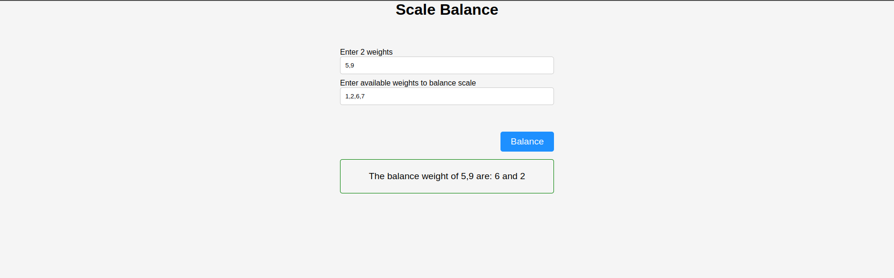

# scale-balancing

## App

## About

This is a simple scale balance simulation app.
Users have to parse in weights representing the left side and right side respectively, and also parse in a number of weights that could be used to balance the scale

## Build With

- Javascript
- HTML
- CSS

### Prerequisites

Knowledge about JS:

- Basic data structures
- Arrays
- Functions
- Git

## Clone project

- To get a local copy up and running follow these simple example steps.
- Clone this repository with `https://github.com/abuemkezeChu/scale-balancing.git` using your terminal or command line.
- Change to the project directory by entering: cd grocery-list-application in the terminal.

## Command line steps

- $ git clone `$ https://github.com/abuemkezeChu/scale-balancing.git`
- $ `cd scale-balancing`
- $ `git checkout feature/scale-balance

## Live Site

[scale-balance](https://abuemkezechu.github.io/scale-balancing/)

## Author

👤 **Abuemkeze Chu**

- GitHub: [@abuemkezeChu](https://github.com/abuemkezeChu)
- Twitter: [@abuemkeze](https://twitter.com/abuemkeze)
